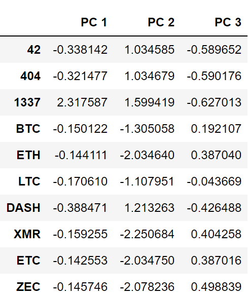

# CrytoCurrencies
## Analysis Overview
The purpose of this project is to use unsupervised machine learning to analyze a database of cryptocurrencies and create a report including the traded cryptocurrencies classified by group according to their features.

The following methods were used for this analysis:

- Preprocessing the data for Principal Component Analysis(PCA)
- Reducing data dimensions using PCA
- Clustering cryptocurrencies using K-Means
- Visualizing classification results with 2D and 3D scatter plots

#### Resources:
- Cryptocurrency dataset: [crypto_data.csv](https://github.com/nhafer88/Cryptocurrencies/blob/main/Resources/crypto_data.csv), [CryptoCompare](https://min-api.cryptocompare.com/data/all/coinlist)
- Jupyter Notebook, Python and additional libraries: Pandas, Plotly, hvPlot,scikit-learn, and Imbalanced-learn 
## Results
### Preprocessing the Data for PCA
- Updated the dataframe after completing prepocessing steps (seen in the image below).
- Also, assigned dummy variables and scaled Algorithm and ProofType columns for PCA processing

- There are 532 Cryptocurrencies for analysis.

### Reducing data dimensions using PCA
- Using the PCA algorithm reduced the dimensions of the above data down to three principal components (PC 1, PC 2, PC 3---seen in image below).

### Clustering cryptocurrencies using K-Means
- Elbow curve is utilized to determine best value of K (best number of clusters).
- Best value of K=4 (seen in image below)

- New dateframe identifying coin names and classes (0-3---Seen in below image)

### Visualizing classification results with 2D and 3D scatter plots
- The clusters are plotted using a 3D-Scatter with each data point shows the CoinName and Algorithm when hovering over with cursor (seen in image below).

- A table with tradable cryptocurrencies is created with hvPlot library (seen in below image).

A hvPlot scatter plot is created with interactive info box when hovering over each point (seen in below image).

## Summary and Recommendation
This analysis provides incite about relationships between each cryptocurrency. Further analsyis is needed to explore their similarities/differences, which could be used for aiding investment strategies.
